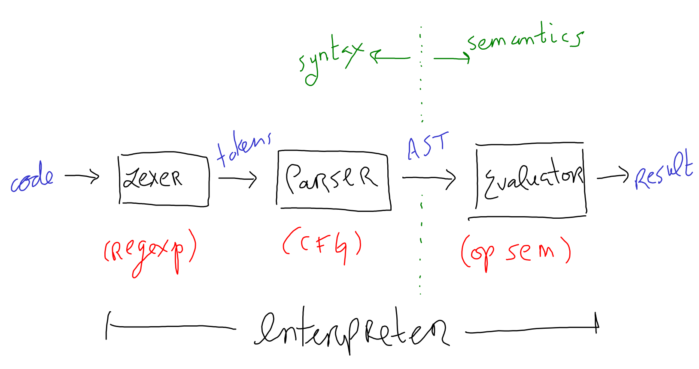

# Notes 10: NanOCaml Syntax
Date: Tuesday July 3rd

<!--- ADMIN: Quiz next discussion. Start working on the
      next project. -->

<!--- TIME: 30 minutes -->

## Syntax and semantics

When defining programming languages, we usually make the following
distinction.

* The **syntax** of a language is what it looks like.
* The **semantics** of a language is what the components mean.

Both are critical aspects of language design.



## The NanOCaml grammar

We are implementing a stripped down version of OCaml called NanOCaml.
Today, we will focus only on the syntax of NanOCaml, in other words
writing the lexer and parser.


This grammar implies a natural set of tokens.

```ocaml
type token =
  Tok_Fun              (* fun *)
| Tok_Var of string    (* [a-z]+ *)
| Tok_Arrow            (* -> *)
| Tok_LParen           (* ( *)
| Tok_RParen           (* ) *)
| Tok_EOF              (* end of file *)
```

And a natural abstract syntax tree.

```ocaml
type var = string
type expr =
  Fun of var * expr
| App of expr * expr
| Var of var
```

Here is an example input and how it should turn out from each
of your functions.

```ocaml
lexer "((fun x -> x) y)" =
[Tok_LParen; Tok_LParen; Tok_Fun; Tok_Var "x";
 Tok_Arrow; Tok_Var "x"; Tok_RParen;
  Tok_Var "y"; Tok_RParen; Tok_EOF]

(parser (lexer "((fun x -> x) y)")) =
App (Fun ("x", Var "x"), Var "y")
```

## Fixing the grammar

There is one major problem with our grammar though. It has
conflicting first sets! Therefore, it cannot be parsed with
a recursive descent parser as is. We can fix that with
left factoring.


<!--- TIME: 50 minutes -->
<!--- CUE: Have students work on the graded exercise. -->
